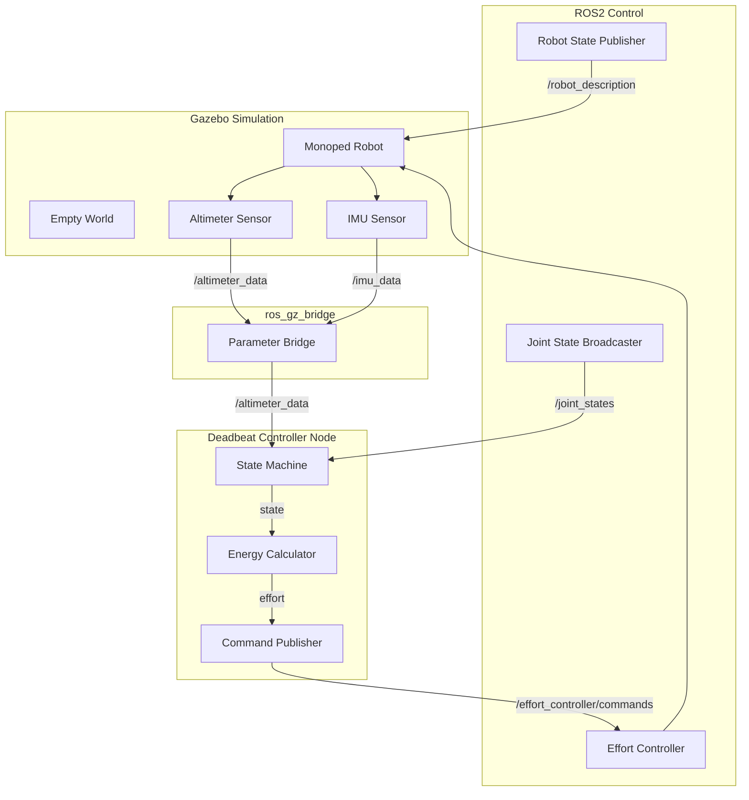
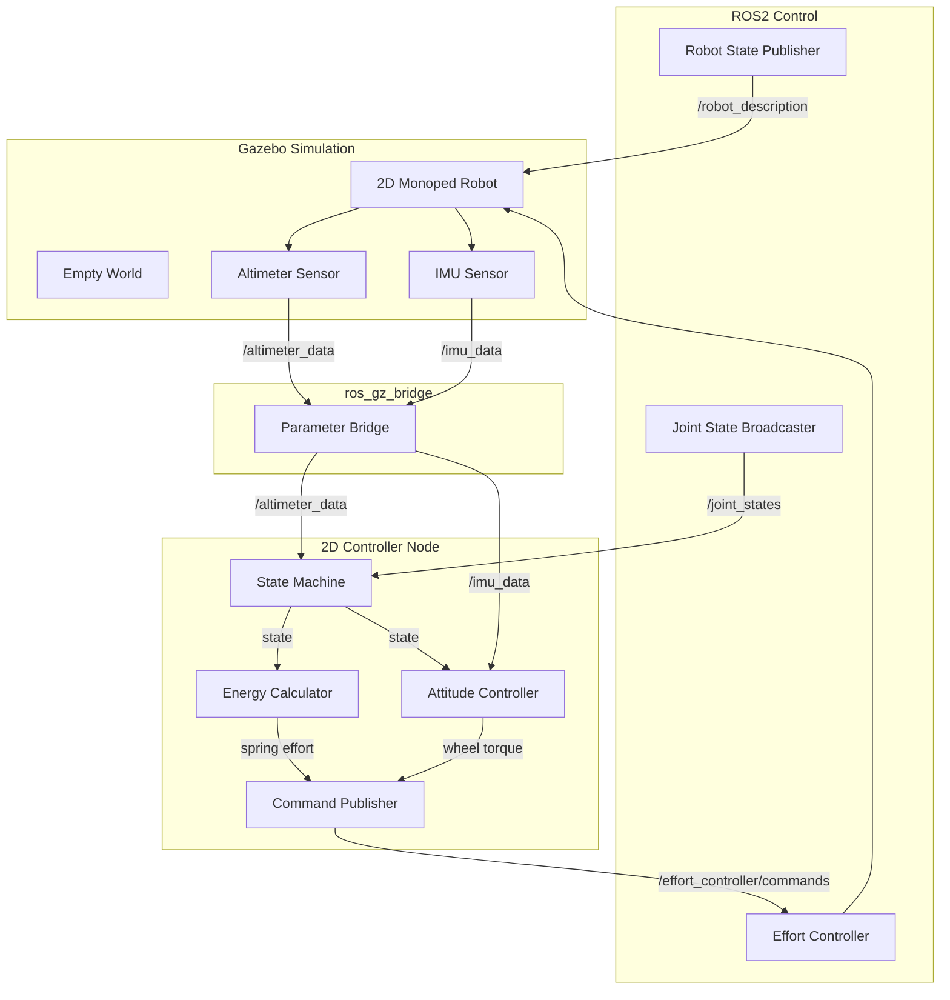
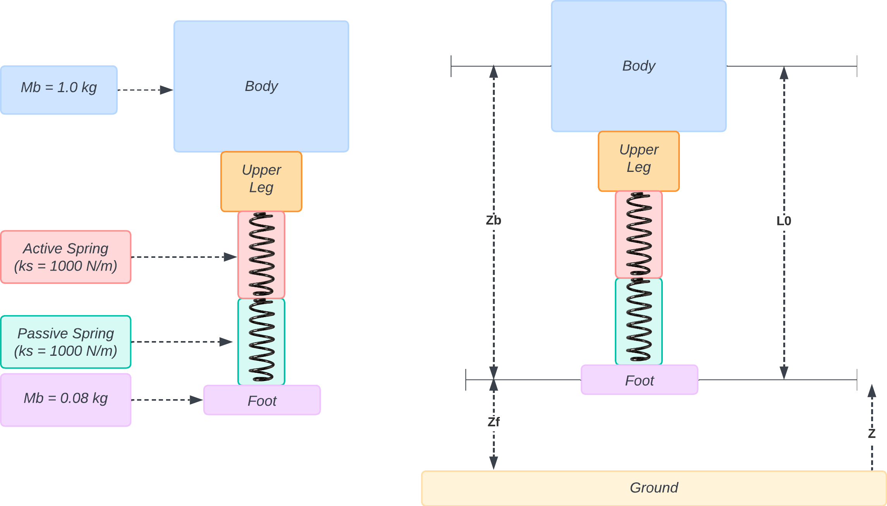
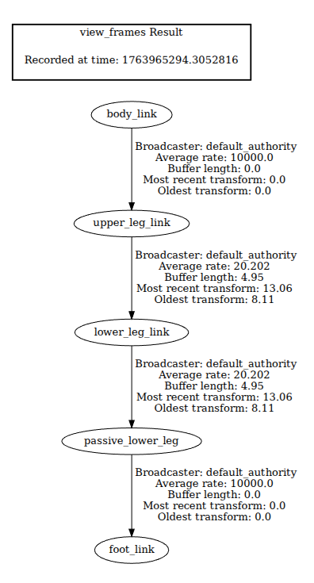
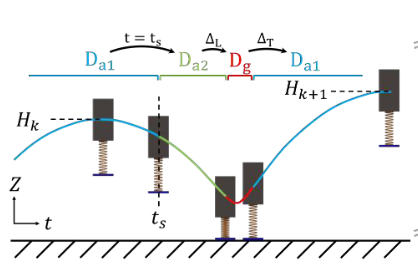
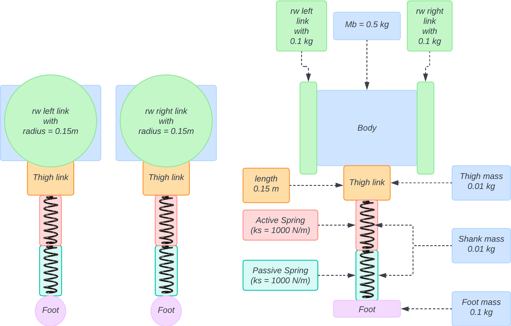
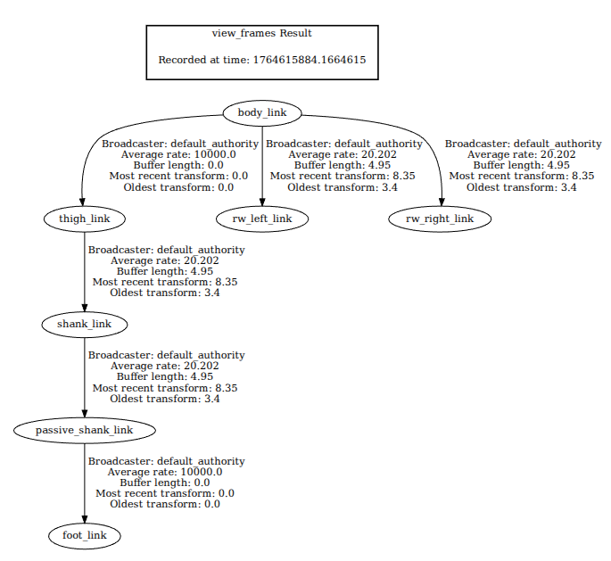
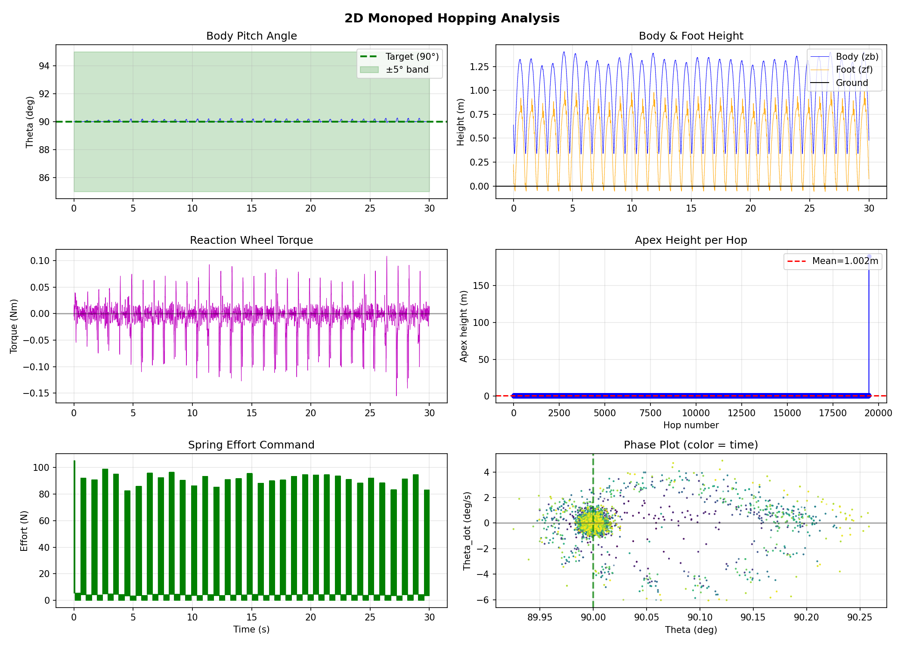
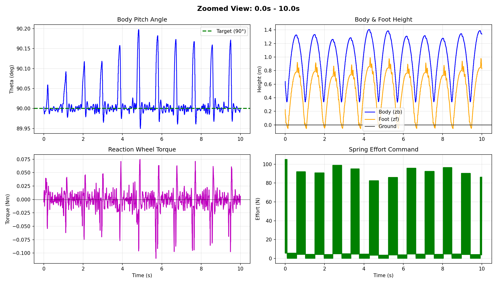

# FRA502 Project Jumping_Monopedal

## Table of Contents
- [System Architecture](#system-architecture)
- [Installation](#installation)
- [1D Monopedal Robot Model With Deadbeat Controller (undamped case)](#1d-monopedal-robot-model-with-deadbeat-controller-undamped-case)
- [2D Monopedal Robot Model With Reaction Wheel (undamped case)](#2d-monopedal-robot-model-with-reaction-wheel-undamped-case)
- [Members](#members)
- [References](#references)

## System Architecture

### Phase 1: 1D Monopedal Robot Model With Deadbeat Controller (undamped case)



**Nodes:**
- **Robot State Publisher**: Publishes robot URDF to `/robot_description`
- **Joint State Broadcaster**: Publishes joint positions to `/joint_states`
- **Effort Controller**: Receives effort commands and applies force to joints
- **Deadbeat Controller**: Main control logic with state machine and energy calculation
- **ros_gz_bridge**: Bridges Gazebo topics to ROS2

### Phase 2: 2D Monopedal Robot Model With Reaction Wheel (undamped case)



**Nodes:**
- **Robot State Publisher**: Publishes robot URDF to `/robot_description`
- **Joint State Broadcaster**: Publishes joint positions to `/joint_states`
- **Effort Controller**: Receives effort commands and applies force/torque to joints
- **2D Controller**: Main control logic with state machine, energy calculation, and attitude control
- **ros_gz_bridge**: Bridges Gazebo topics (altimeter, IMU) to ROS2

## Installation
1. Clone the repository:

```bash
git clone https://github.com/phattanaratjeedjeen-sudo/jumping_monopedal.git
```

2. Navigate to the cloned repository and install dependencies:

```bash
cd jumping_monopedal
sudo apt update && sudo apt upgrade
rosdep update
rosdep install -y --from-paths src --ignore-src --rosdistro $ROS_DISTRO
```
3. Build the workspace (please ensure you are in the workspace folder; if not, please cd to the workspace folder):

```bash
colcon build --symlink-install
```

4. Source the workspace

```bash
source install/setup.bash
```

> [!TIP]
> Alternatively, you can add this line to your `~/.bashrc` file to source the workspace automatically when you open a new terminal.
> ```bash
> echo "source ~/jumping_monopedal/install/setup.bash" >> ~/.bashrc
> source ~/.bashrc
> ```


## 1D Monopedal Robot Model With Deadbeat Controller (undamped case)

This implementation is based on the **Compress-Release Hopper (CRH)** model described in [[1]](#references).

Or You can read the full report [here](./Ambrose%20et%20al.%20-%202019%20-%20Design%20and%20Comparative%20Analysis%20of%201D%20Hopping%20Robots.pdf).


### Usage
To run the 1D monopedal robot simulation with the deadbeat controller, use the following command:

```bash
ros2 launch monoped_description sim.launch.py
```


### Model Description



Our implementation uses a modified CRH model with two springs:
- **Active Spring**: Controlled by effort controller (energy release)
- **Passive Spring**: Stores energy naturally during ground contact

#### TF Tree (URDF Structure)

<p align="center">
  
</p>

The robot consists of 5 links connected in series:
- **body_link** → **upper_leg_link** (fixed joint)
- **upper_leg_link** → **lower_leg_link** (prismatic joint + active spring)
- **lower_leg_link** → **passive_lower_leg** (prismatic joint + passive spring)
- **passive_lower_leg** → **foot_link** (fixed joint)

#### Coordinate Definitions

| Symbol | Description | Value/Formula |
|--------|-------------|---------------|
| $z_b$ | Body height from ground | Variable (measured by altimeter) |
| $z_f$ | Foot height from ground | $z_f = z_b - L_0$ |
| $L_0$ | Spring equilibrium length | 0.38 m (from body center to foot) |
| $z$ | Vertical axis | Positive upward from ground (z=0) |

Where $q_1$ and $q_2$ are the prismatic joint displacements (spring compressions).

#### Model Parameters

| Parameter | Symbol | Value |
|-----------|--------|-------|
| Body mass | $M_b$ | 1.0 kg |
| Foot mass | $M_f$ | 0.08 kg |
| Active Spring stiffness | $k_s$ | 1000 N/m |
| Passive Spring stiffness | $k_s$ | 1000 N/m |
| Spring equilibrium length | $L_0$ | 0.38 m |

### Hybrid Domain Cycle

<p align="center">
  
</p>

The hopping motion follows a hybrid cycle with multiple domains:

| Domain | Description | Transition |
|--------|-------------|------------|
| $D_{a1}$ | First air phase (hardstop active, spring uncompressed) | $t = t_s$ → $D_{a2}$ |
| $D_{a2}$ | Second air phase (spring compression before landing) | $\Delta_L$ (landing impact) → $D_g$ |
| $D_g$ | Ground phase (foot on ground, spring stores/releases energy) | $\Delta_T$ (takeoff impact) → $D_{a1}$ |

**Key Variables:**
- $H_k$ — Apex height of current hop
- $H_{k+1}$ — Apex height of next hop
- $t_s$ — Time to start spring compression
- $\Delta_L$ — Landing impact (reset map)
- $\Delta_T$ — Takeoff impact (reset map)

### Controller Design (Undamped Case)

The deadbeat controller calculates the required energy input to reach the desired hop height using:

$$u(Hc, Hd) = EL + ET + EH$$

Where:
- $EL = Mf \times g \times (Hc - L0)$ — Energy lost at landing impact
- $ET = (Mb + Mf) \times g \times (Hd - L0) \times \frac{Mf}{Mb}$ — Energy lost at takeoff impact
- $EH = (Mb + Mf) \times g \times (Hd - Hc)$ — Potential energy for height change

The desired spring compression is then:

$$
\delta^* = \sqrt{\frac{2u}{k_s}}
$$

### Demo Video


For better view plsease watch the [video here](images/demo-phase1.mp4).

### Simulation Results

| Parameter | Value |
|-----------|-------|
| Desired height (Hd) | 0.50 m |
| Mean apex height | 0.52 m |
| Std deviation | ±0.034 m |
| Number of hops | 159 |
| Convergence | ~5-10 hops |

#### Hopping Behavior Analysis


**Plot Description:**
1. **Top**: Body and foot height over time showing stable periodic hopping
2. **Second**: Apex height convergence from initial ~0.76m to target ~0.5m
3. **Third**: Phase plot (zb vs velocity) showing convergence to limit cycle
4. **Bottom**: Effort commands applied during compress phase

### Key Observations

1. **Fast Convergence**: The controller achieves near-deadbeat convergence (~5-10 hops)
2. **Stable Periodic Orbit**: System converges to a stable limit cycle
3. **Small Steady-State Error**: Mean height (0.52m) slightly above target (0.50m) due to simulation dynamics

## 2D Monopedal Robot Model With Reaction Wheel (undamped case)

This implementation is based on the **Torque Driven Spring Loaded Inverted Pendulum (TD-SLIP)** model described in [[2]](#references). Or You can read the full report [here](./2407.12120%202.pdf).

By this phase are develop base from Phase 1 [1D Monopedal Robot Model With Deadbeat Controller (undamped case)](#1d-monopedal-robot-model-with-deadbeat-controller-undamped-case).

### Usage
To run the 2D monopedal robot simulation with the reaction wheel controller, use the following command:

```bash
ros2 launch monoped_2d_description sim.launch.py
```


### Model Description



#### TF Tree (URDF Structure)

<p align="center">
  
</p>

#### Model Parameters

| Parameter | Symbol | Value |
|-----------|--------|-------|
| Body mass | $M_b$ | 0.5 kg |
| Reaction wheel mass (per wheel) | $M_{rw}$ | 0.1 kg |
| Thigh mass | $M_{thigh}$ | 0.01 kg |
| Shank mass | $M_{shank}$ | 0.01 kg |
| Foot mass | $M_{foot}$ | 0.1 kg |
| Spring stiffness | $k_s$ | 1000 N/m |
| Spring equilibrium length | $L_0$ | 0.30 m |
| Body dimensions | $b_x, b_y, b_z$ | 0.15 × 0.15 × 0.15 m |
| Thigh length | $l_{thigh}$ | 0.15 m |
| Shank length | $l_{shank}$ | 0.15 m |
| Reaction wheel radius | $r_{rw}$ | 0.15 m |
| Reaction wheel damping | $b_{rw}$ | 0.0 N·m·s/rad |
| Reaction wheel friction | $f_{rw}$ | 0.0 |

### Controller Design

The 2D controller combines vertical hopping control with pitch stabilization using reaction wheels:

#### Vertical Control (TD-SLIP)
Similar to Phase 1, uses deadbeat control for hop height regulation with state-dependent spring force.

#### Pitch Stabilization (Reaction Wheel)
Uses a state-feedback controller with torque saturation and rate limiting:

$$\tau = N_{bar} \theta_d - (K_0 \theta + K_1 \dot{\theta})$$

**Saturation Constraints:**
- Maximum torque: $|\tau| \leq 2.5$ Nm
- Torque rate limit: $|\dot{\tau}| \leq 10$ Nm/s

**Control Gains:**
- Ground phase: $K_g = [2.895, 0.257]$, $N_g = 2.9$
- Flight phase: $K_f = [14.068, 0.5625]$, $N_f = 14.068$

**Stability Mechanisms:**
1. **Torque Saturation**: Prevents excessive control effort
2. **Rate Limiting**: Smooths torque commands to prevent oscillations
3. **Joint Damping**: Passive damping (1.0 N·m·s/rad) reduces wheel overshoot

### Demo Video


For better view please watch the [video here](images/demo-phase2.mp4).

### Simulation Results

| Parameter | Value |
|-----------|-------|
| Duration | 425.89 seconds |
| Samples | 127,501 |
| Desired height (Hd) | 1.5 m |
| Mean apex height | 1.002 m |
| Std deviation (height) | ±1.388 m |
| Mean pitch angle | 90.06° |
| Std deviation (pitch) | ±1.17° |
| Number of hops | 19,479 |
| Final theta | 122.05° (fell) |


#### Hopping and Attitude Behavior Analysis



**Plot Description:**
1. **Top Left**: Body pitch angle (theta) showing stable oscillation around 90° target
2. **Top Right**: Body and foot height showing periodic hopping behavior
3. **Middle Left**: Reaction wheel torque commands
4. **Middle Right**: Apex height per hop showing convergence
5. **Bottom Left**: Spring effort commands during compress phase
6. **Bottom Right**: Phase portrait (theta vs theta_dot) showing limit cycle behavior

#### Zoomed View (First 10 seconds)



### Key Observations

1. **Attitude Stabilization**: Reaction wheels successfully maintain pitch angle near 90° (mean = 90.06°, std = 1.17°)
2. **Hopping Performance**: Robot achieved 19,479 hops over 425 seconds with mean apex height of 1.002m
3. **Physics Instability**: Gazebo physics explosion occurred near end of simulation (theta_dot spike to 2.9M °/s)
4. **Controller Robustness**: Controller performed correctly; the crash was due to Gazebo collision detection failure, not controller error

## Members

- ศิวรุตม์ จุลพรหม, 67340800002
- พัฒนรัตน์ จีดจีน, 68430700410
- พีรดนย์ เรืองแก้ว, 67340700403

## References
- [1] Ambrose et al., "Design and Comparative Analysis of 1D Hopping Robots," IEEE/RSJ International Conference on Intelligent Robots and Systems (IROS), 2019. DOI: [10.1109/IROS40897.2019.8967692](https://doi.org/10.1109/IROS40897.2019.8967692)  
- [2] Optimizing Design and Control of Running Robots Abstracted as Torque Driven Spring Loaded Inverted Pendulum (TD-SLIP). DOI: [10.48550/arXiv.2407.12120](https://doi.org/10.48550/arXiv.2407.12120)
